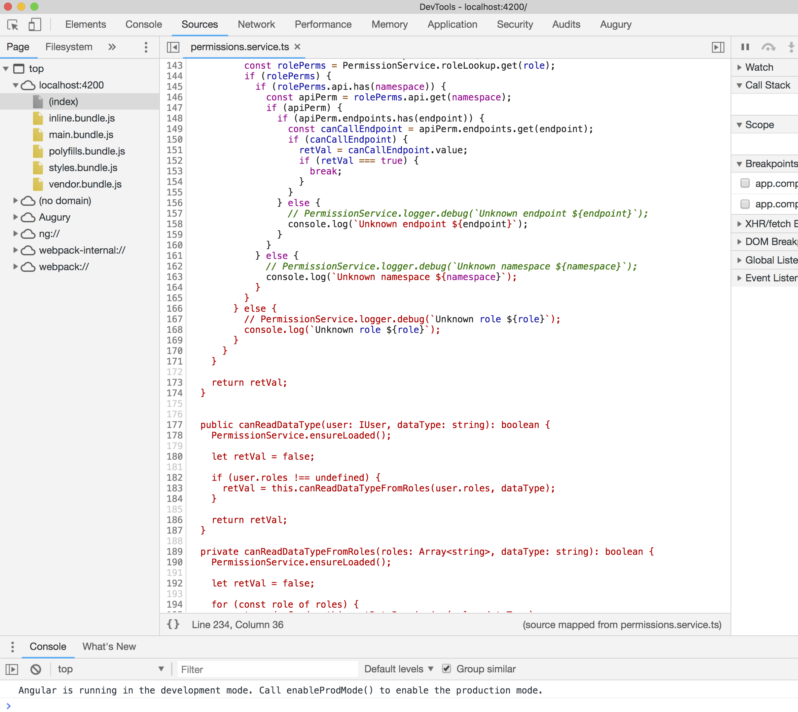

repo to reproduce chrome error: 
Sourcemaps containing ` break syntax highlighting further down the line
https://bugs.chromium.org/p/chromium/issues/detail?id=659515

---

this is an angular cli app

git clone https://github.com/chadbr/chrome-template-string-debug.git

npm install

ng s (to serve the app)

open chrome - navigate to http://localhost:4200/

open developer tools

cmd+p - open permissions.service.ts

scroll down to see problem:

